<p align="center">
  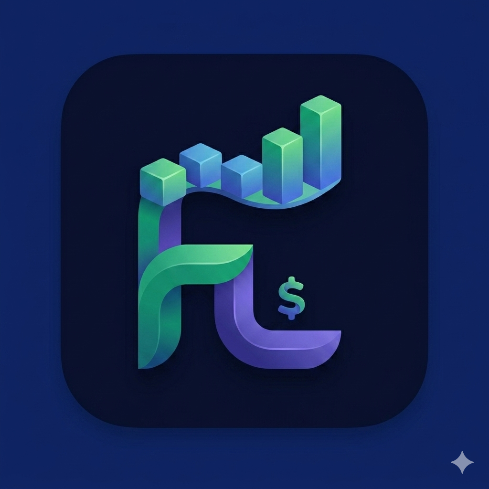
</p>

<h1 align="center">Flex Ledger</h1>

<p align="center">
  <strong>Control de gastos offline, bonito y sin complicarte la vida.</strong>
</p>

<p align="center">
  
  
  
  
  
</p>

---

## Índice

- [Vista previa](#vista-previa)
- [Qué hace la app](#qué-hace-la-app)
- [Recorrido visual](#recorrido-visual)
- [Arquitectura](#arquitectura)
- [Capa de datos](#capa-de-datos)
- [Stack tecnológico](#stack-tecnológico)
- [Estructura del proyecto](#estructura-del-proyecto)
- [Funcionalidades implementadas](#funcionalidades-implementadas)
- [Desarrollo local](#desarrollo-local)
- [Builds y actualizaciones OTA](#builds-y-actualizaciones-ota)

---

## Vista previa

<p align="center">
  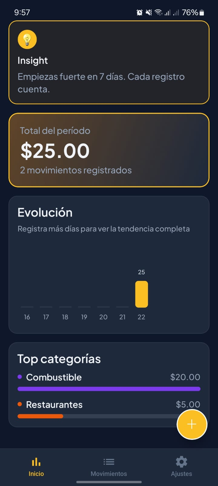
  &nbsp;&nbsp;
  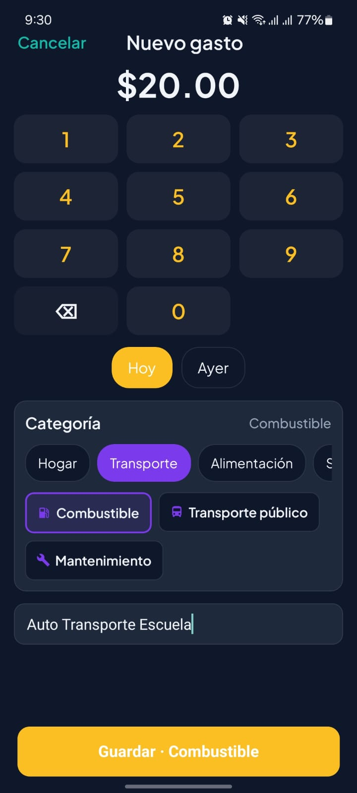
  &nbsp;&nbsp;
  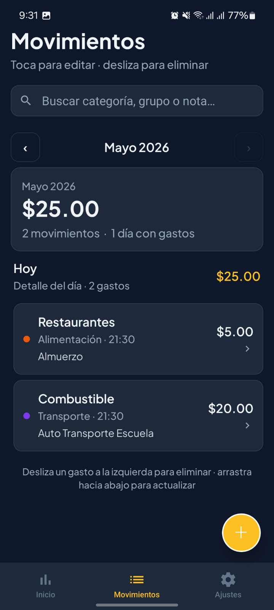
</p>

<p align="center">
  <em>Dashboard inteligente · registro en segundos · historial completo</em>
</p>

---

## Qué hace la app

**Flex Ledger** es una app móvil **offline-first** para registrar y entender tus gastos personales o familiares. Sin hojas de cálculo, sin fricción: abres, tocas **+**, guardas monto y categoría, y listo.

| Pilar | Descripción |
|-------|-------------|
| ⚡ **Registro rápido** | Teclado numérico propio, categorías por grupos, fecha Hoy/Ayer, auto-selección de la última categoría |
| 📊 **Dashboard vivo** | Totales por período, gráfico de evolución, top categorías, insights vs período anterior |
| 🏠 **Hogar / familia** | Perfil con nombre, etiqueta familiar y tamaño del grupo para el “pulso del hogar” |
| 🎯 **Presupuesto** | Meta mensual con barra de progreso y alertas opcionales |
| 🔔 **Recordatorios suaves** | Notificaciones locales según tu ciclo de vida (máx. 3, sin spam) |
| 📤 **Exportación** | Excel enriquecido (.xlsx) con resúmenes por categoría, grupo y mes |
| 🔄 **OTA Updates** | Actualizaciones remotas con EAS Update al abrir la app y búsqueda manual en Ajustes |

---

## Recorrido visual

Las capturas siguen el flujo real desde la primera apertura hasta el uso con datos.

### 1 · Bienvenida

<p align="center">
  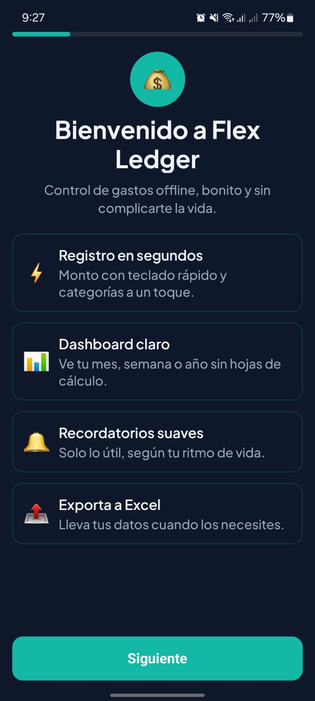
</p>

Presentación de la propuesta: registro en segundos, dashboard claro, recordatorios útiles y exportación a Excel.

---

### 2 · Perfil personal

<p align="center">
  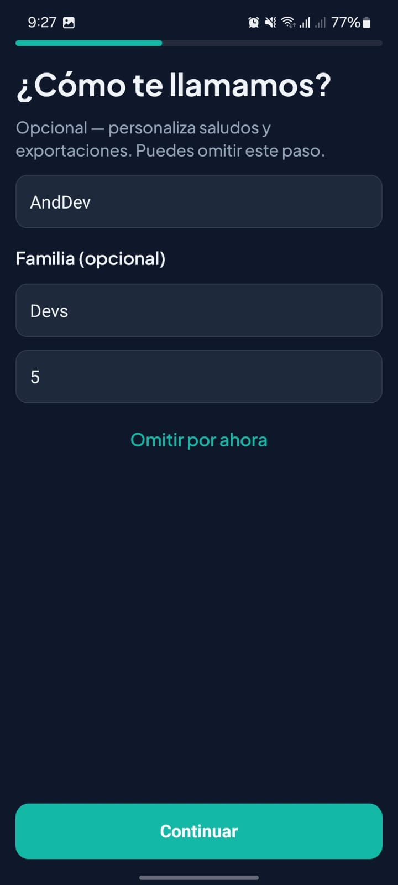
</p>

Nombre, etiqueta familiar (ej. *Devs*) y tamaño del grupo. Opcional — personaliza saludos y exportaciones.

---

### 3 · Color de la app

<p align="center">
  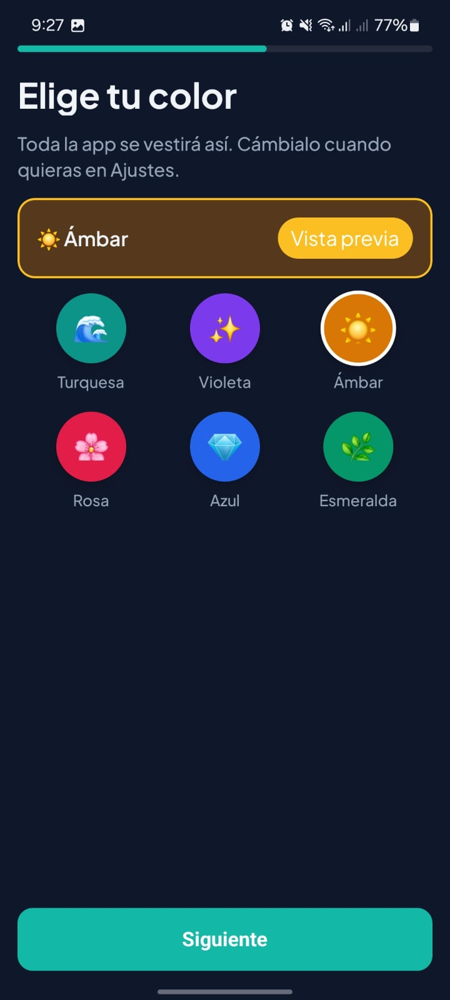
</p>

Seis temas de acento (Turquesa, Violeta, Ámbar, Rosa, Azul, Esmeralda). Se aplica al instante y se puede cambiar después en Ajustes.

---

### 4 · Tu ritmo

<p align="center">
  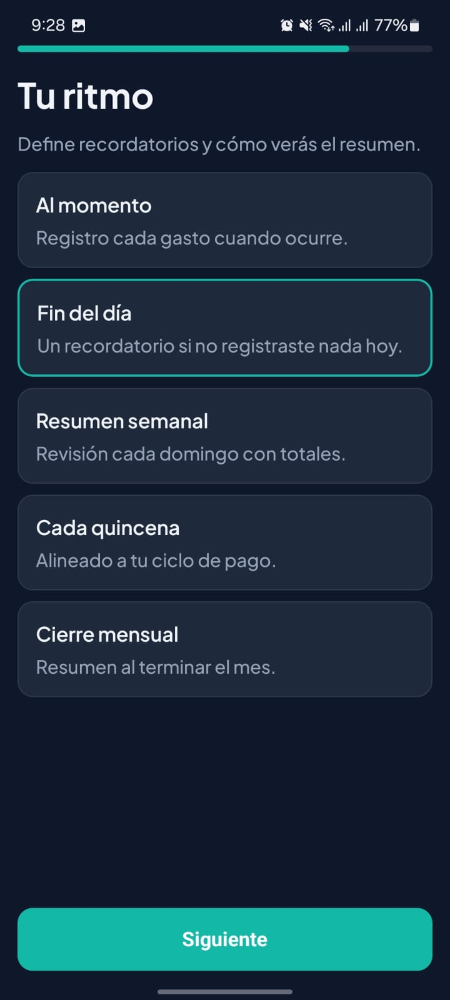
</p>

Define el **ciclo de vida**: al momento, fin del día, resumen semanal, quincena o cierre mensual. Las notificaciones se adaptan a tu hábito.

---

### 5 · Listo para registrar

<p align="center">
  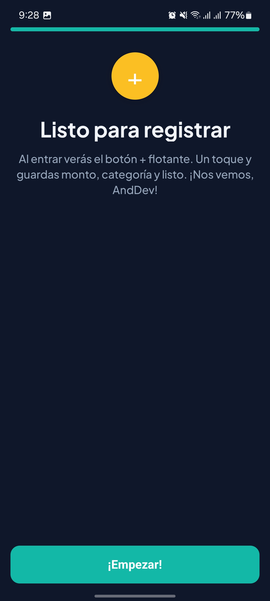
</p>

Cierre del onboarding con mensaje personalizado. La app te guía hacia el botón flotante **+**.

---

### 6 · Coach del FAB

<p align="center">
  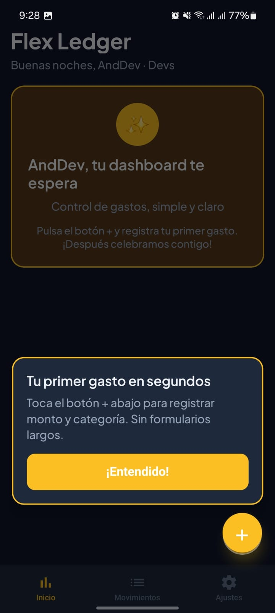
</p>

Overlay de bienvenida en el tab Inicio: *“Tu primer gasto en segundos”* — sin formularios largos.

---

### 7 · Nuevo gasto

<p align="center">
  
</p>

Formulario compacto: monto grande, teclado, chips de fecha, selector de grupo/categoría y nota opcional. Botón **Guardar · {categoría}**.

---

### 8 · Movimientos

<p align="center">
  
</p>

Historial por mes con búsqueda, totales del período, agrupación por día. **Toca para editar · desliza para eliminar** (con undo).

---

### 9–10 · Ajustes

<p align="center">
  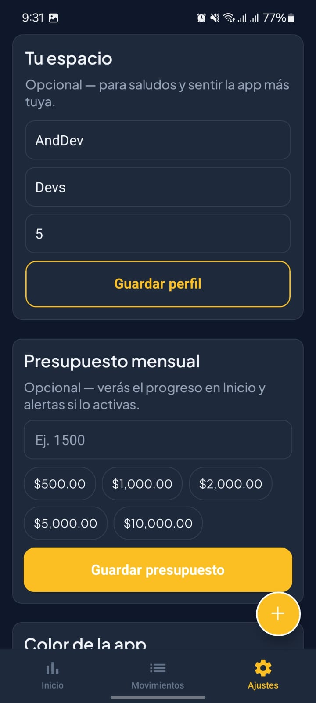
  &nbsp;&nbsp;
  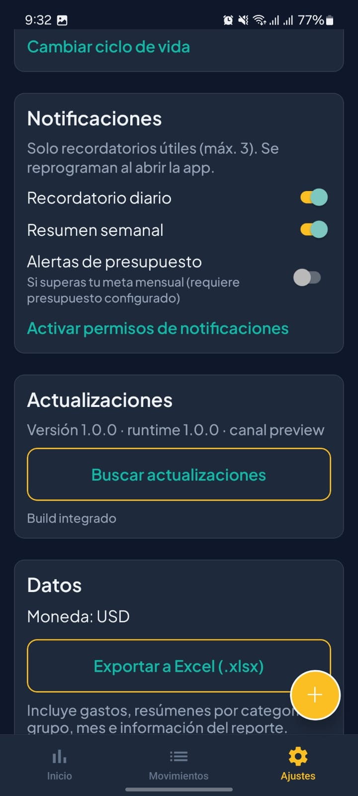
</p>

Perfil, presupuesto mensual, color de la app, grupos/categorías, ciclo de vida, notificaciones, **buscar actualizaciones OTA** y exportar a Excel.

---

### 11–13 · Inicio con datos

<p align="center">
  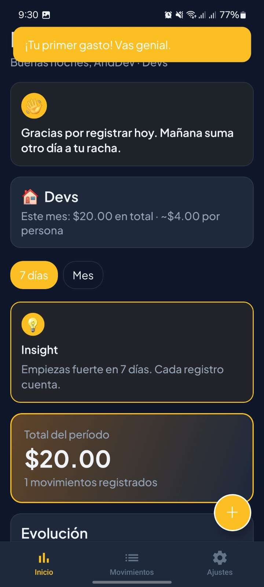
  &nbsp;
  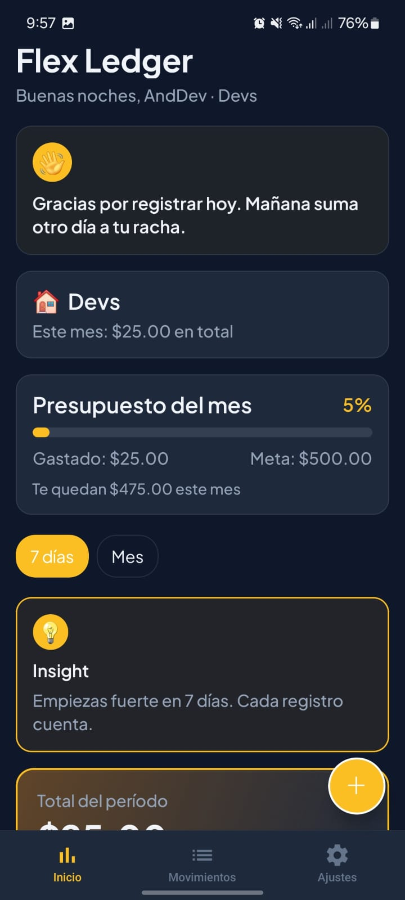
  &nbsp;
  
</p>

El dashboard crece contigo:

- Banner de bienvenida y **racha** de registro
- **Pulso del hogar** con gasto mensual por persona
- Barra de **presupuesto** del mes
- Selector de período (7 días, mes, trimestre…)
- **Insight** comparativo vs período anterior
- Gráfico de **evolución** y **top categorías**

---

### 14 · Grupos y categorías

<p align="center">
  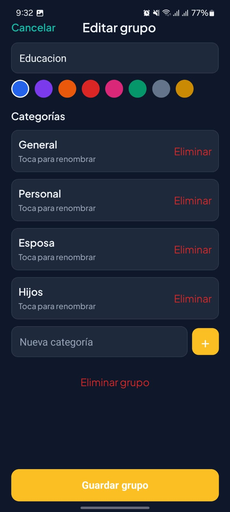
</p>

CRUD completo: nombre, color, categorías con renombrado, alta y eliminación. Tus gastos, tu taxonomía.

---

## Arquitectura

Flex Ledger sigue una arquitectura **en capas** con separación clara entre UI, dominio, datos y servicios nativos.

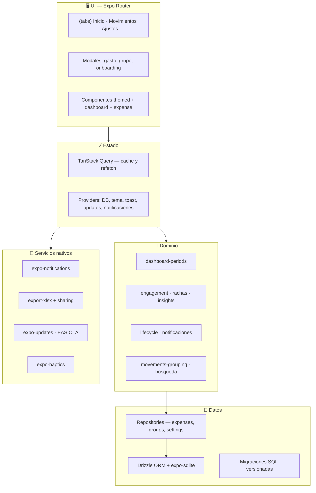

### Flujo de un gasto nuevo

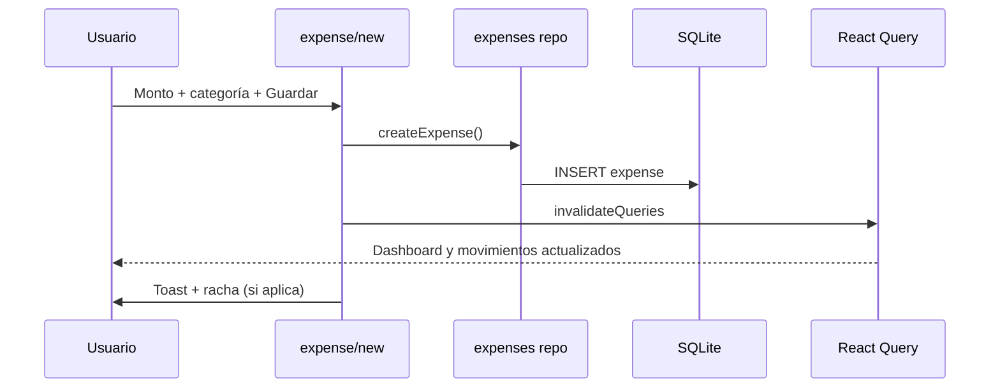

---

## Capa de datos

### Modelo relacional (SQLite)

```
groups ──< categories ──< expenses
                │
         user_settings (singleton)
```

| Tabla | Rol |
|-------|-----|
| `groups` | Contenedores con color e icono (Hogar, Transporte, Alimentación…) |
| `categories` | Subcategorías dentro de un grupo |
| `expenses` | Monto en centavos, categoría, nota, `occurred_at` |
| `user_settings` | Onboarding, perfil, tema, ciclo de vida, presupuesto, prefs de notificación |

### Principios

- **Offline-first**: toda la lectura/escritura va a SQLite local; no hay backend obligatorio.
- **Centavos enteros**: los montos se guardan como `amount_cents` para evitar errores de punto flotante.
- **Soft delete** en grupos/categorías con `deleted_at`.
- **Migraciones Drizzle** versionadas en `drizzle/` con journal.
- **Agregaciones en SQL** para totales por día (con `localtime` para alinear fechas con el gráfico).

### Consultas clave

- `getPeriodTotals` — total, conteo y serie `byDay` para el gráfico
- `getCategoryTotalsForPeriod` — top categorías del dashboard
- `getExpenseStreak` — días consecutivos con al menos un gasto
- `getRecentCategoryIds` — auto-selección silenciosa en el formulario

---

## Stack tecnológico

| Área | Tecnología |
|------|------------|
| Framework | Expo SDK 54 · React Native 0.81 · React 19 |
| Navegación | Expo Router 6 (file-based) |
| Base de datos | expo-sqlite + Drizzle ORM |
| Estado servidor | TanStack Query v5 |
| UI | Themed components · Plus Jakarta Sans · temas de acento |
| Animaciones | react-native-reanimated · expo-linear-gradient |
| Gestos | react-native-gesture-handler (swipe to delete) |
| Notificaciones | expo-notifications (locales, reprogramadas al abrir) |
| Export | xlsx + expo-sharing + expo-file-system |
| Updates | expo-updates + EAS Update (canales preview/production) |
| Build | EAS Build · runtimeVersion `appVersion` |

---

## Estructura del proyecto

```
flex-ledger/
├── app/                      # Pantallas (Expo Router)
│   ├── (onboarding)/         # Flujo de bienvenida
│   ├── (tabs)/               # Inicio, Movimientos, Ajustes
│   ├── expense/              # Nuevo / editar gasto
│   ├── group/                # CRUD grupos
│   └── preferences/          # Ciclo de vida
├── src/
│   ├── components/           # UI por feature (dashboard, expense, settings…)
│   ├── domain/               # Reglas de negocio puras
│   ├── repositories/         # Acceso a SQLite
│   ├── services/             # Dashboard, export, notificaciones, OTA
│   ├── hooks/                # React Query wrappers
│   ├── providers/            # Contextos globales
│   ├── db/                   # Schema Drizzle + seed
│   └── utils/                # Moneda, gráficos, haptics…
├── drizzle/                  # Migraciones SQL
├── assets/
│   ├── images/               # Iconografía (icon, splash, adaptive)
│   └── captures-app-production/  # Capturas de producción (1–14)
├── app.json                  # Config Expo + EAS Update
└── eas.json                  # Perfiles build (preview, production)
```

---

## Funcionalidades implementadas

### Core
- [x] Onboarding guiado (4 pasos + coach del FAB)
- [x] CRUD de gastos con teclado numérico
- [x] Grupos y categorías personalizables
- [x] Dashboard con períodos adaptativos (7d → año)
- [x] Movimientos por mes con búsqueda y swipe delete + undo

### Premium & engagement
- [x] Temas de acento (6 colores)
- [x] Tipografía Plus Jakarta Sans
- [x] Toasts con undo
- [x] Rachas y mensajes contextuales (hora del día)
- [x] Pulso del hogar y bienvenida cálida
- [x] Insights vs período anterior
- [x] Presupuesto mensual con barra de progreso
- [x] Skeletons y pull-to-refresh

### Datos & plataforma
- [x] Exportación Excel enriquecida
- [x] Notificaciones locales según ciclo de vida
- [x] EAS Update: chequeo `ON_LOAD` + botón en Ajustes
- [x] Gráfico de evolución corregido para builds de producción

---

## Desarrollo local

```bash
# Dependencias
npm install

# Servidor de desarrollo
npm start

# Generar migración Drizzle (tras cambiar schema)
npm run db:generate
```

> **Nota:** Las actualizaciones OTA y algunas APIs nativas solo funcionan en **builds EAS** (preview/production), no en Expo Go.

---

## Builds y actualizaciones OTA

```bash
# Build interno (preview)
eas build --profile preview --platform android

# Publicar actualización JS al canal preview
npm run update:preview -- --message "Descripción del cambio"

# Producción
eas build --profile production --platform android
npm run update:production -- --message "Descripción del cambio"
```

| Perfil EAS | Canal | Uso |
|------------|-------|-----|
| `development` | development | Dev client |
| `preview` | preview | Pruebas internas + OTA |
| `production` | production | Tiendas + OTA |

Configuración en `app.json`:
- `updates.url` → servidor EAS Update
- `runtimeVersion.policy: appVersion`
- `updates.checkAutomatically: ON_LOAD`

---

<p align="center">
  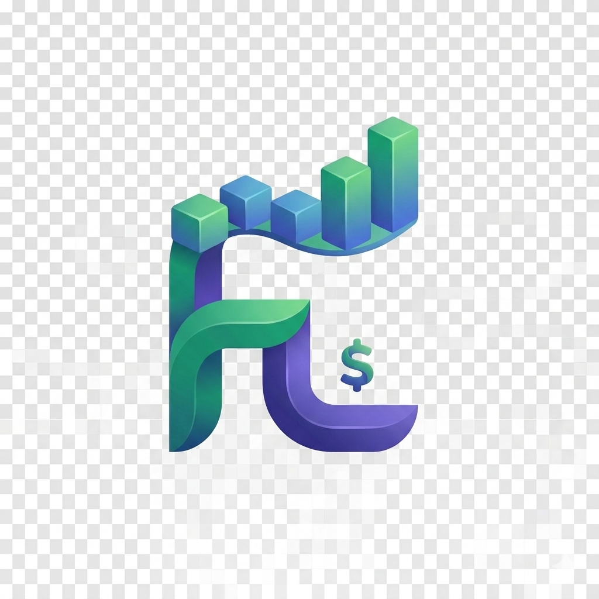
</p>

<p align="center">
  Hecho con ☕ para registrar gastos sin fricción.
</p>
